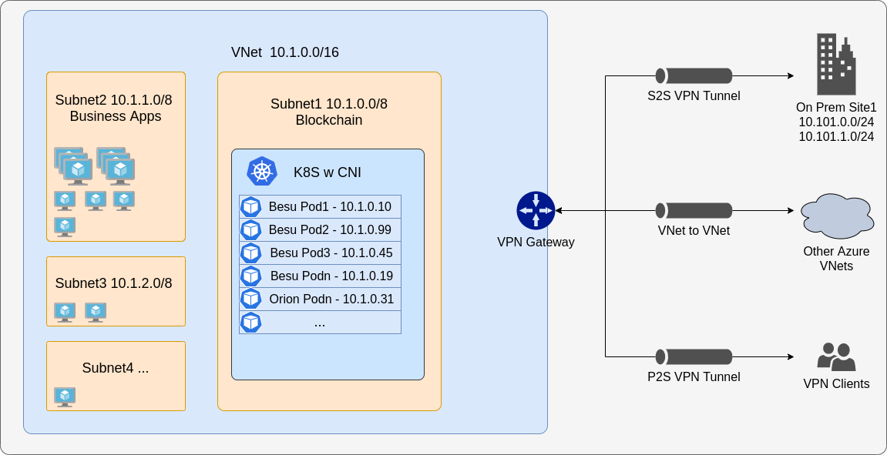

## Prerequisites
1. Create a resource group if you haven't got one ready for use. 
```bash
az deployment create \
  --name MY_RESOURCE_GROUP_NAME \
  --location eastus \
  --template-file ./resource-group.json
```

2. Don't create more than one AKS cluster in the same subnet.
3. AKS clusters may **not** use _169.254.0.0/16, 172.30.0.0/16, 172.31.0.0/16, or 192.0.2.0/24_ for the Kubernetes service address range.
4. To interact with Azure APIs, an AKS cluster requires an Azure Active Directory (AD) [Service Principal](https://docs.microsoft.com/en-us/azure/aks/kubernetes-service-principal). The Service Principal (SP) is needed to dynamically create and manage other Azure resources such as an Azure load balancer, container registry (ACR) etc

Unless specified, the SP is assigned the 'Contributor' role by default - this has full permissions to read and write to your Azure account which isn't ideal from a security standpoint.
Instead, create a new SP without any roles assigned to it. The template will then append the necessary permissions.
 
Create an SP like so:
```bash
az ad sp create-for-rbac --name "MY_RBAC_NAME" --skip-assignment
# Get the objectId using the appId from the response
az ad sp show --id <appId> --query objectId
```

NOTE: When you create a Service Principal, take note of the following in the response (redacted eg shown below):
```bash
{
  "appId": "2d3.....748",
  "displayName": "abcd..",
  "name": "http://abcd..",
  "password": "a07.....c0d",
  "tenant": "172.....f81"
}
```
- **Service principal Client ID** is your _**appId**_
- **Service principal Client Secret** is the _**password**_ value
- **Service principal Tenant ID** is the _**tenant**_ value


For this deployment we will provision (to your SP) and use the following permissions: 
```bash
# permissions on the subnet within your virtual network i.e Azure's `Network Contributor` role
- Microsoft.Network/virtualNetworks/subnets/join/action
- Microsoft.Network/virtualNetworks/subnets/read

# The VM where Helm is installed requires permissions to communicate with the cluster and provision Besu i.e Azure's `Azure Kubernetes Service Cluster Admin Role` role
- Microsoft.ContainerService/managedClusters/listClusterAdminCredential/action
```

## Description
This deployment template will create an AKS cluster for you in Azure, as well as a VM to run helm from to provision the cluster. Part of the process is that it will install Helm3 and the [Besu Helm charts](https://github.com/PegaSysEng/besu-kubernetes) in the home directory of the VM.

## Deployment

* Navigate to the [Azure portal](https://portal.azure.com), click `+ Create a resource` in the upper left corner.
* Search for `Template deployment (deploy using custom templates)` and click Create.
* Click on `Build your own template in the editor`
* Remove the contents (json) in the editor and paste in the contents of `azuredeploy.json`
* Click Save
* The template will be parsed and a UI will be shown to allow you to input parameters to provision

Alternatively use the CLI
```bash
az deployment create \
  --name besu-k8s \
  --location eastus \
  --template-file ./azuredeploy.json \
  --parameters clusterName=besu location=westus adminUsername=YOUR_UNAME  adminSSHPublicKey=YOUR_SSH_PUBKEY servicePrincipalClientId=YOUR_SPCID servicePrincipalClientSecret=YOUR_SPCS servicePrincipalTenantId=YOUR_SPTID servicePrincipalObjectId= SPOID
```

Once the deployment has completed, please ssh into the Helm VM (DNS address can be found in the outputs of the template), and use the credentials you supplied during provisioning.

To connect to the Kubernetes dashboard, please follow the steps under 'View Kubernetes dashboard' shown in the settings of your cluster in the [Azure Portal](https://portal.azure.com/) 
```
az aks browse --resource-group YOUR_RG --name YOUR_AKS_CLUSTER_NAME
```

Pick any of the chart solutions and deploy to the cluster. For example say you pick 'ibft2':

```bash
cd $HOME
cd besu-kubernetes
cd helm\ibft2
helm install besu ./besu
```

To install an ingress to viw the Besu Grafana dashboards or connect to the RPC endpoint (grafana shown below, please select one or both when deploying and also apply the ingress rules):

```bash
cd $HOME
cd besu-kubernetes
cd ingress
helm install grafana-ingress stable/nginx-ingress --namespace monitoring --set controller.replicaCount=2 --set rbac.create=true
kubectl -f ingress-rules-grafana.yaml 
```


Once deployed, services are available as follows on the IP/ of the ingress controllers:

```bash

# Grafana address: 
http://<GRAFANA_INGRESS_IP>:80/d/XE4V0WGZz/besu-overview?orgId=1&refresh=10s

# HTTP RPC API:
curl -X POST -H "Content-Type: application/json" --data '{"jsonrpc":"2.0","method":"net_peerCount","params":[],"id":1}' http://<BESU_INGRESS_IP>/jsonrpc/
# which should return (confirming that the node running the JSON-RPC service has peers):
{
  "jsonrpc" : "2.0",
  "id" : 1,
  "result" : "0x4"
}

# HTTP GRAPHQL API:
curl -X POST -H "Content-Type: application/json" --data '{ "query": "{syncing{startingBlock currentBlock highestBlock}}"}' http://<BESU_INGRESS_IP>/graphql/graphql/
# which should return 
{
  "data" : {
    "syncing" : null
  }
}

## Azure Deployment with CNI
By default, AKS clusters use **kubenet**, and a virtual network and subnet are created for you. With kubenet, nodes get an IP address from a virtual network subnet. Network address translation (NAT) is then configured on the nodes, and pods receive an IP address "hidden" behind the node IP. This approach reduces the number of IP addresses that you need to reserve in your network space for pods to use, however places constraints on what can connect to the nodes from outside the cluster (eg on prem nodes)

With Azure Container Networking Interface (CNI), every pod gets an IP address from the subnet and can be accessed directly. These IP addresses must be unique across your network space, and must be planned in advance. Each node has a configuration parameter for the maximum number of pods that it supports. The equivalent number of IP addresses per node are then reserved up front for that node. This approach requires more planning, and can leads to IP address exhaustion as your application demands grow, however makes it easier for external nodes to connect to your cluster.




Please look at  the `./aks/cni` folder for an example setup. To run this example, you need to *first* deploy the VNet and then deploy the aks cluster. What you see is the VNet that gets deployed first which creates 'n' subnets, the first used to the k8s cluster and the rest for normal business applications. If you have existing VNets, you can easily connect to the VNet with the k8s cluster by using [VNet Peering](https://docs.microsoft.com/en-us/azure/virtual-network/virtual-network-peering-overview)


